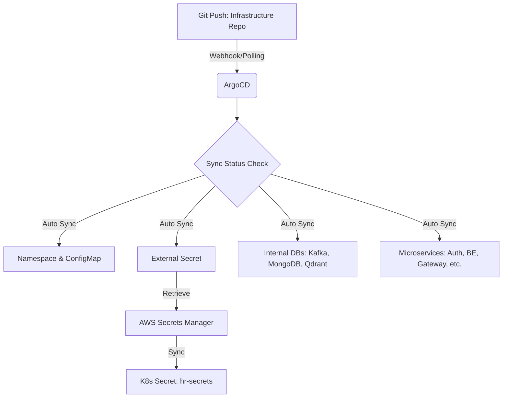

# HRadar System - EKS 운영 및 배포 가이드 (GitOps)

이 문서는 HRadar 시스템을 AWS EKS 환경에 처음 배포하거나 확장할 때 필요한 사전 요구 사항과 전체적인 배포 흐름을 정의합니다.

---

## 1. 사전 요구 사항 (Prerequisites)

실제 리소스를 배포하기 전에 AWS 콘솔 및 로컬 환경에서 다음 항목들이 준비되어야 합니다.

### A. 인프라 리소스 구성
1. **EKS Cluster**: 배포 대상이 될 EKS 클러스터가 필요합니다.
2. **RDS (MariaDB)**: 보안 그룹 설정이 완료된 RDS 인스턴스가 필요합니다.
3. **ElastiCache (Redis)**: 클러스터 모드가 지원되는 Redis 클러스터가 필요합니다.
4. **S3 Bucket**: 파일 저장을 위한 S3 버킷 (`s3-hradar-bucket`)이 필요합니다.

### B. AWS 시크릿 설정 (가장 중요)
`HIT-HRadar-Infra/aws-env-secrets.txt` 가이드에 따라 다음 시크릿들을 **AWS Secrets Manager**에 생성해야 합니다:
- `prod/hr-system/common`: DB_HOST, REDIS_HOST, JWT_SECRET_KEY, MONGO_USER, MONGO_PASSWORD 등
- `rds!db-8465fc3a...`: RDS 암호 이름에 `DB_PASSWORD` 저장

### C. IRSA (IAM Role for Service Accounts) 설정
Pod가 AWS Secrets Manager 및 S3에 접근할 수 있도록 IAM Role을 구성하고 전용 ServiceAccount와 연결해야 합니다.
- **IAM Policy**: `SecretsManagerReadWrite`, `S3FullAccess` (또는 최소 권한 정책) 권한 포함.
- **ServiceAccount**: `hr-system` 네임스페이스에 `hr-system-sa` 이름으로 생성 및 IAM Role ARN 어노테이션 추가.

### D. 필수 컨트롤러 설치
클러스터에 다음 도구들이 설치되어 있어야 합니다:
1. **ArgoCD**: GitOps 배포 관리.
2. **External Secrets Operator (ESO)**: AWS Secrets Manager의 값을 K8s Secret으로 자동 동기화.

---

## 2. 전체 배포 Flow (Deployment Flow)

시스템은 **ArgoCD를 통한 GitOps 방식**으로 자동 배포됩니다.



---

## 3. 단계별 배포 순서

### Step 1: 네임스페이스 및 IRSA 적용
가장 먼저 네임스페이스를 생성하고 권한 설정을 완료합니다.
```bash
kubectl apply -f HIT-HRadar-Infra/k8s/namespace.yaml
# (별도 진행) IRSA SA 생성 및 IAM Role 연결
```

### Step 2: 초기 인프라 설정 적용 (Secret & Config)
시크릿 동기화와 공용 설정을 먼저 배포합니다.
```bash
kubectl apply -f HIT-HRadar-Infra/k8s/secrets-store.yaml
kubectl apply -f HIT-HRadar-Infra/k8s/configmap.yaml
```
*Tip: `kubectl get secret hr-secrets -n hr-system`으로 시크릿이 정상 생성되었는지 확인하세요.*

### Step 3: 내부 데이터베이스 배포
애플리케이션이 구동되기 위해 필요한 내부 DB(StatefulSet)를 배포합니다.
```bash
kubectl apply -f HIT-HRadar-Infra/k8s/zookeeper.yaml
kubectl apply -f HIT-HRadar-Infra/k8s/kafka.yaml
kubectl apply -f HIT-HRadar-Infra/k8s/mongodb.yaml
kubectl apply -f HIT-HRadar-Infra/k8s/qdrant.yaml
```

### Step 4: 마이크로서비스 및 ArgoCD 등록
마지막으로 애플리케이션을 배포합니다. ArgoCD를 사용한다면 다음 명령어로 전체 자동화 환경을 구축합니다.
```bash
kubectl apply -f HIT-HRadar-Infra/argocd/project.yaml
kubectl apply -f HIT-HRadar-Infra/argocd/application.yaml
```

---

## 4. 운영 및 유지보수 (Ops)

- **이미지 버전 업데이트**: `k8s/hr-*.yaml` 파일에서 이미지 태그만 수정하여 Git Push하면 ArgoCD가 즉시 무중단 배포를 진행합니다.
- **로그 확인**: `kubectl logs -f deployment/hr-backend -n hr-system` 등으로 확인.
- **모니터링**: ArgoCD UI를 통해 각 리소스의 Sync 상태와 헬스 체크 여부를 실시간으로 모니터링하세요.
